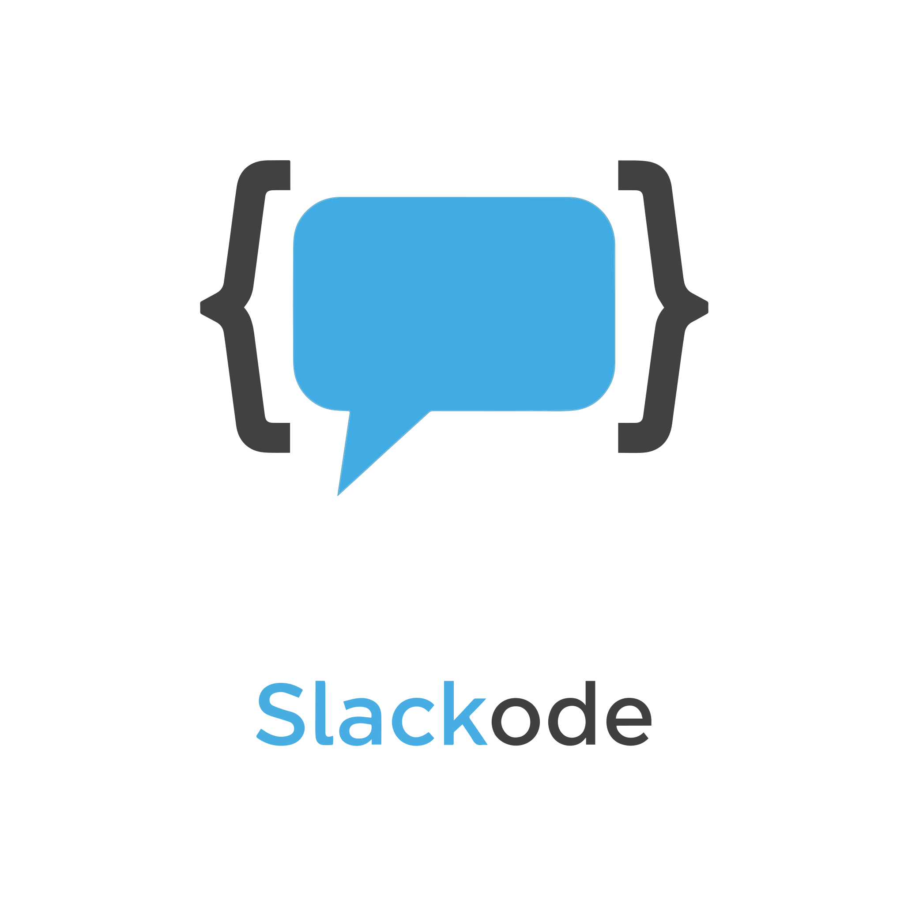

<p align="center">
  
</p>

A Slack bot that answers questions about your codebase. Point it at any GitHub repo and ask questions via @mentions or DMs — it uses [OpenCode](https://opencode.ai) to explore the code and respond with accurate, cited answers.

## How it works

1. **Clones your repo** into the container and keeps it updated hourly
2. **Generates context files** on startup by analyzing the repo structure, key abstractions, and conventions using an OpenCode agent
3. **Answers questions** via Slack — @mention in a channel or DM directly. Uses OpenCode's tool-use (grep, read, glob, bash) to find answers in the actual code
4. **Maintains conversation context** — follow-up questions in the same Slack thread share the same OpenCode session
5. **Streams progress** — shows intermediate status in Slack as the agent works ("Looking into this..." -> "Using: grep, read..." -> final answer)
6. **Tailors responses by role** — pulls your Slack profile (title, status) and channel context to adjust technical depth

The bot is strictly **read-only** — it will never suggest code changes, write diffs, or offer to implement anything. It explains the current state of the codebase.

## Prerequisites

- [Docker](https://docs.docker.com/get-docker/) and Docker Compose
- A Slack workspace where you can create apps
- A GitHub account with access to the target repo
- A GitHub Copilot subscription (default LLM provider) or API key for another [supported provider](#providers)

## Setup

### 1. Create a Slack App

1. Go to [api.slack.com/apps](https://api.slack.com/apps) and click **Create New App** > **From scratch**
2. Name it (e.g. "Slackode") and select your workspace

**Enable Socket Mode:**

3. Go to **Settings** > **Socket Mode** and enable it
4. Create an app-level token with the `connections:write` scope — save this as your `SLACK_APP_TOKEN` (starts with `xapp-`)

**Set bot scopes:**

5. Go to **Features** > **OAuth & Permissions** > **Scopes** > **Bot Token Scopes** and add:
   - `app_mentions:read` — receive @mention events
   - `chat:write` — send messages
   - `im:read` — receive DM events
   - `im:write` — send DMs
   - `im:history` — read DM history
   - `users:read` — fetch user profile info (name, title, status)
   - `channels:read` — fetch channel info (name, topic, purpose)

**Enable events:**

6. Go to **Features** > **Event Subscriptions** and enable events
7. Under **Subscribe to bot events**, add:
   - `app_mention`
   - `message.im`

**Install the app:**

8. Go to **Settings** > **Install App** and click **Install to Workspace**
9. Copy the **Bot User OAuth Token** — this is your `SLACK_BOT_TOKEN` (starts with `xoxb-`)

**Enable DMs:**

10. Go to **Features** > **App Home** and check **Allow users to send Slash commands and messages from the messages tab**

### 2. Configure your LLM provider

Slackode defaults to GitHub Copilot but supports [many providers](#providers). To use a different provider, set `PROVIDER` and `MODEL` in your `.env` and skip the Copilot steps below.

**GitHub Copilot (default):**

Standard GitHub PATs (`ghp_`, `github_pat_`) do **not** work for Copilot auth — you need an OAuth token from the device flow.

1. Install and run OpenCode locally:
   ```bash
   npm install -g opencode-ai
   opencode auth login
   ```
2. Complete the device flow in your browser
3. Copy the token from the auth file:
   ```bash
   cat ~/.local/share/opencode/auth.json
   ```
4. The `access` field value (starts with `gho_`) is your `COPILOT_TOKEN`

### 3. Create a GitHub PAT

If your target repo is private, create a [fine-grained personal access token](https://github.com/settings/tokens?type=beta) with **Contents: Read** access to the repo. This is your `GITHUB_TOKEN`.

For public repos, this is optional but avoids rate limiting.

### 4. Configure environment

```bash
cp .env.example .env
```

Edit `.env` and fill in all values:

```env
SLACK_BOT_TOKEN=xoxb-...
SLACK_APP_TOKEN=xapp-...
TARGET_REPO=your-org/your-repo
GITHUB_TOKEN=ghp_...

# Default provider (GitHub Copilot)
PROVIDER=github-copilot
MODEL=claude-sonnet-4.6
COPILOT_TOKEN=gho_...

# Or use a different provider:
# PROVIDER=anthropic
# MODEL=claude-sonnet-4-5-20250514
# ANTHROPIC_API_KEY=sk-ant-...
```

### 5. Run

```bash
docker compose up --build -d
```

First startup takes a few minutes — it clones the repo, starts the OpenCode server, and generates context files by analyzing the codebase. Watch the logs:

```bash
docker compose logs -f
```

You'll see:
```
OpenCode server is ready (took 1s).
Slack bot is running (OpenCode server: http://127.0.0.1:4096)
[context-gen] Starting full context generation (no prior context found)...
[context-gen] Context generation complete (full, sha: abc1234).
```

Once the bot is running, @mention it in a channel or DM it directly.

## Usage

**In a channel:**
```
@Slackode how does authentication work in this codebase?
```

**In a DM:**
```
What Django apps handle the API layer?
```

**Follow-up in the same thread:**
```
Where are the serializers for that?
```

The bot keeps conversation context within a thread — follow-ups don't need to repeat background information.

### Custom instructions per channel

You can set custom instructions that are included with every question sent from a specific channel (or DM). Use them to steer the bot toward specific areas of the codebase or adjust the level of detail.

**Set instructions:**
```
@Slackode /config set Focus on the Django REST framework views and serializers. Assume the reader is familiar with DRF.
```

**View current instructions:**
```
@Slackode /config show
```

**Clear instructions:**
```
@Slackode /config clear
```

Custom instructions work in both channels and DMs (max 1000 characters). The bot also reads the channel topic and purpose automatically, so for lightweight hints you can just put them there.

## Architecture

```
┌─────────────────────────────────────────────┐
│  Docker Container                           │
│                                             │
│  ┌──────────────┐    ┌───────────────────┐  │
│  │  Slack Bot    │───>│  OpenCode Server  │  │
│  │  (Node.js)   │<───│  (port 4096)      │  │
│  └──────────────┘    └───────────────────┘  │
│         │                     │              │
│         v                     v              │
│  ┌──────────────┐    ┌───────────────────┐  │
│  │  sessions.db  │    │  Cloned Repo      │  │
│  │  (SQLite)     │    │  + Context Files  │  │
│  └──────────────┘    └───────────────────┘  │
└─────────────────────────────────────────────┘
         │                      │
         v                      v
    Slack API             LLM Provider API
    (Socket Mode)         (configurable)
```

- **Slack Bot** — Bolt for JavaScript with Socket Mode. Handles @mentions and DMs, manages thread-to-session mapping in SQLite, streams progress updates.
- **OpenCode Server** — runs inside the container, provides the agent runtime with tools (bash, read, grep, glob). Two agents: `build` (read-only Q&A, default) and `context` (generates reference docs about the repo).
- **Context Files** — auto-generated on startup and refreshed hourly. Provide the LLM with a pre-built understanding of the repo structure, key abstractions, and conventions so it can answer faster and more accurately.

## Configuration

| Env var | Required | Description |
|---------|----------|-------------|
| `SLACK_BOT_TOKEN` | Yes | Bot User OAuth Token (`xoxb-...`) |
| `SLACK_APP_TOKEN` | Yes | App-Level Token with `connections:write` (`xapp-...`) |
| `TARGET_REPO` | Yes | GitHub repo in `owner/name` format |
| `GITHUB_TOKEN` | For private repos | PAT with repo read access |
| `PROVIDER` | No | LLM provider (default: `github-copilot`) |
| `MODEL` | No | Model ID (default: `claude-sonnet-4.6`) |
| `COPILOT_TOKEN` | For github-copilot | GitHub Copilot OAuth token (`gho_...`) |
| `OPENCODE_URL` | No | OpenCode server URL (default: `http://127.0.0.1:4096`) |
| `SESSIONS_DB_PATH` | No | Path to sessions SQLite DB (default: `./sessions.db`) |

### Providers

Slackode uses [OpenCode](https://opencode.ai) under the hood, which supports many LLM providers. Set `PROVIDER` and `MODEL` in your `.env` along with the provider's API key:

| Provider | `PROVIDER` | Example `MODEL` | Required env var |
|----------|-----------|-----------------|-----------------|
| GitHub Copilot | `github-copilot` | `claude-sonnet-4.6` | `COPILOT_TOKEN` |
| Anthropic | `anthropic` | `claude-sonnet-4-5-20250514` | `ANTHROPIC_API_KEY` |
| OpenAI | `openai` | `gpt-4.1` | `OPENAI_API_KEY` |
| Amazon Bedrock | `amazon-bedrock` | `us.anthropic.claude-sonnet-4-5-v2-20250514` | `AWS_ACCESS_KEY_ID`, `AWS_SECRET_ACCESS_KEY`, `AWS_REGION` |
| OpenRouter | `openrouter` | `anthropic/claude-sonnet-4` | `OPENROUTER_API_KEY` |
| Google Vertex AI | `google-vertex-ai` | `claude-sonnet-4-5` | `GOOGLE_CLOUD_PROJECT`, `GOOGLE_APPLICATION_CREDENTIALS` |
| Groq | `groq` | `llama-3.3-70b-versatile` | `GROQ_API_KEY` |
| DeepSeek | `deepseek` | `deepseek-chat` | `DEEPSEEK_API_KEY` |

For the full list of providers and models, see the [OpenCode providers docs](https://opencode.ai/docs/providers).

## Volumes

Docker Compose mounts two named volumes for persistence across restarts:

| Volume | Container path | Purpose |
|--------|---------------|---------|
| `repo-cache` | `/app/repo` | Cloned repo (avoids re-clone on restart) |
| `opencode-data` | `/home/appuser/.local/share/opencode` | OpenCode state + bot sessions DB |

## Development

To work on the bot code locally (the bot still runs inside Docker):

```bash
npm install
npm run build
docker compose up --build
```

The TypeScript source is in `src/`:

```
src/
├── index.ts              # Bolt app setup, Socket Mode, context gen scheduling
├── opencode.ts           # OpenCode SDK client, streaming, context generation
├── sessions.ts           # SQLite thread-to-session persistence
├── handlers/
│   ├── mention.ts        # @mention handler
│   └── dm.ts             # DM handler
└── utils/
    ├── formatting.ts     # Markdown -> Slack mrkdwn conversion
    ├── slack-context.ts  # Fetches user/channel info from Slack API
    └── progress.ts       # Throttled Slack message updater
```

## Security

Slackode is designed to be safe to deploy on a shared network. The following measures are in place:

**Container isolation**
- Runs as a non-root user (`appuser`) inside the container
- Filesystem is mounted read-only (`read_only: true`) with a small tmpfs at `/tmp`
- The OpenCode server binds to `127.0.0.1:4096` — not accessible outside the container

**Credential handling**
- Git credentials are supplied via `GIT_ASKPASS` — they never appear in the repo URL, `ps` output, or `.git/config`
- Copilot auth (when using `github-copilot` provider) is written with `printf` to avoid shell interpretation of special characters
- Other providers use standard API key env vars passed directly to the container

**Input validation**
- `TARGET_REPO` is validated against a strict `owner/repo` regex on startup
- User questions are wrapped in `<user_question>` delimiter tags with explicit anti-injection instructions so the LLM treats them as opaque questions, not directives

## License

MIT
