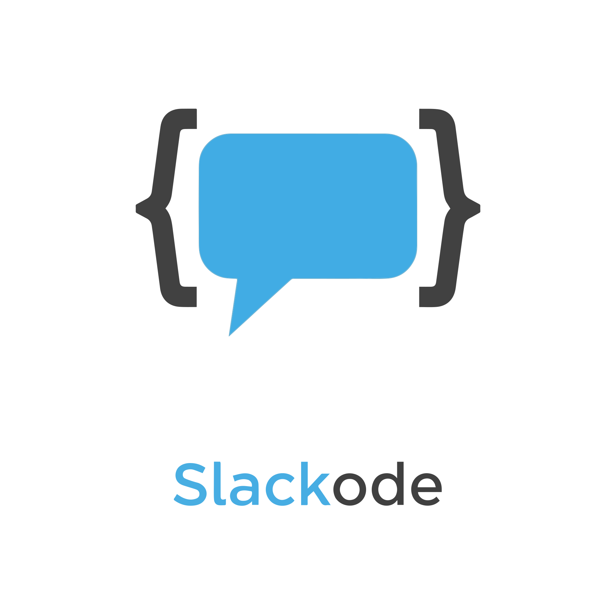

<p align="center">
  
</p>

A Slack bot that answers questions about your codebase, writes code, and accumulates institutional knowledge. Point it at any git repo (GitHub, GitLab, Bitbucket, or self-hosted) and interact via @mentions or DMs — it uses [OpenCode](https://opencode.ai) to explore code, connect to external tools, and respond with accurate, cited answers.

## How it works

1. **Clones your repo(s)** into the container and keeps them updated hourly
2. **Generates context files** on startup by analyzing repo structure, key abstractions, and conventions
3. **Answers questions** via Slack — @mention in a channel or DM directly. Uses OpenCode's tool-use (grep, read, glob, bash) to find answers in the actual code
4. **Writes code** — start a coding session with `code <description>` and the bot works in an isolated git worktree, then creates a PR when done
5. **Learns over time** — the bot has a memory system that stores conventions, decisions, and corrections. It saves important things proactively and recalls them via semantic search
6. **Connects to external services** — plug in MCP tools (Linear, Sentry, etc.) and the bot can look up tickets, errors, and more alongside the codebase
7. **Manages corporate knowledge** — add company guidelines, coding standards, and repo-specific docs via Slack commands. Searchable via semantic search

### Q&A features

- **Thread context** — follow-ups in the same thread share the same session
- **@mention in existing threads** — reads the preceding conversation for context
- **File attachments** — attach images (PNG, JPEG, GIF, WebP) or PDFs (up to 10 MB)
- **Linked threads** — paste a Slack thread link and the bot fetches that conversation as context
- **Role-aware responses** — pulls your Slack profile to adjust technical depth
- **Progress streaming** — shows intermediate status as the agent works

## Prerequisites

- [Docker](https://docs.docker.com/get-docker/) and Docker Compose
- A Slack workspace where you can create apps
- Access to the target git repo (GitHub, GitLab, Bitbucket, or self-hosted)
- A GitHub Copilot subscription (default LLM provider) or API key for another [supported provider](#providers)

## Setup

### 1. Create a Slack App

1. Go to [api.slack.com/apps](https://api.slack.com/apps) and click **Create New App** > **From an app manifest**
2. Select your workspace
3. Paste the contents of [`slack-manifest.yaml`](slack-manifest.yaml) and click **Create**

This configures all required scopes, events, and settings automatically.

**Generate tokens:**

4. Go to **Settings** > **Basic Information** > **App-Level Tokens**, create a token with the `connections:write` scope — this is your `SLACK_APP_TOKEN` (starts with `xapp-`)
5. Go to **Settings** > **Install App** and click **Install to Workspace**
6. Copy the **Bot User OAuth Token** — this is your `SLACK_BOT_TOKEN` (starts with `xoxb-`)

### 2. Configure your LLM provider

Slackode defaults to GitHub Copilot but supports [many providers](#providers). To use a different provider, set `PROVIDER` and `MODEL` in your `.env` and skip the Copilot steps below.

**GitHub Copilot (default):**

Standard GitHub PATs (`ghp_`, `github_pat_`) do **not** work for Copilot auth — you need an OAuth token from the device flow.

1. Install and run OpenCode locally:
   ```bash
   npm install -g opencode-ai
   opencode auth login
   ```
2. Complete the device flow in your browser
3. Copy the token from the auth file:
   ```bash
   cat ~/.local/share/opencode/auth.json
   ```
4. The `access` field value (starts with `gho_`) is your `COPILOT_TOKEN`

### 3. Create a Git PAT

If your target repo is private, create a personal access token with read access:
- **GitHub**: [Fine-grained token](https://github.com/settings/tokens?type=beta) with **Contents: Read**
- **GitLab**: [Project access token](https://docs.gitlab.com/user/project/settings/project_access_tokens/) with **read_repository**
- **Bitbucket**: [Repository access token](https://support.atlassian.com/bitbucket-cloud/docs/repository-access-tokens/) with **Read** scope

This is your `GIT_TOKEN`. For public repos, this is optional but avoids rate limiting.

### 4. Configure environment

```bash
cp .env.example .env
```

Edit `.env` and fill in all values:

```env
SLACK_BOT_TOKEN=xoxb-...
SLACK_APP_TOKEN=xapp-...
REPO_URL=https://github.com/your-org/your-repo.git
GIT_TOKEN=ghp_...

# Default provider (GitHub Copilot)
PROVIDER=github-copilot
MODEL=claude-sonnet-4.6
COPILOT_TOKEN=gho_...

# Or use a different provider:
# PROVIDER=anthropic
# MODEL=claude-sonnet-4-5-20250514
# ANTHROPIC_API_KEY=sk-ant-...
```

### 5. Run

```bash
docker compose up --build -d
```

First startup takes a few minutes — it clones the repo, starts the OpenCode server, and generates context files by analyzing the codebase. Watch the logs:

```bash
docker compose logs -f
```

Once the bot is running, @mention it in a channel or DM it directly.

## Usage

### Asking questions

**In a channel:**
```
@Slackode how does authentication work in this codebase?
```

**In a DM:**
```
What Django apps handle the API layer?
```

**Follow-up in the same thread:**
```
Where are the serializers for that?
```

The bot is **read-only** in Q&A mode — it explains the current state of the codebase without suggesting changes.

### Coding sessions

Start a coding session to have the bot write code in an isolated git worktree:

```
@Slackode code add rate limiting to the /api/upload endpoint
```

The bot will:
1. Create a worktree and branch off the latest `main`
2. Optionally plan the changes first (if the task is complex) — you review and approve
3. Write the code
4. Show a summary of changes

**Commands inside a coding thread:**
- `status` — show current diff and session info
- `pr` — create a pull request from the changes
- `done` — create a PR and end the session
- `cancel` — discard changes and clean up
- `agents` — list available agent profiles

You can also specify an agent: `code --agent my-agent fix the flaky test`

### Multi-repo support

Register additional repos and assign them to channels:

```
@Slackode repo add backend https://github.com/org/backend.git
@Slackode repo add frontend https://github.com/org/frontend.git
@Slackode repo list
@Slackode repo default backend
```

Assign a repo to a channel:
```
@Slackode config set repo frontend
```

Questions in that channel will focus on the assigned repo. The bot can still reference other repos if asked explicitly.

### Memory system

The bot accumulates institutional knowledge over time — team conventions, decisions, corrections — and uses semantic search (LanceDB + local embeddings) to recall them in context.

**Manual commands:**
```
@Slackode remember: we always use Zod for request validation, never joi
@Slackode remember --global: all PRs need two approvals before merging
@Slackode remember --channel: this channel is for the payments team
@Slackode recall: validation library
@Slackode forget: 42
@Slackode memories
```

**Automatic saving:** The agent also saves memories proactively via its `save_memory` tool. When you correct the bot or state a convention ("actually, we use X", "we never do Y"), the agent recognizes this as worth remembering and saves it without asking.

**How recall works:** Memories are embedded with a local model (all-MiniLM-L6-v2) and stored in LanceDB. When the agent needs context — or when you use `recall:` — it searches by semantic similarity, not just keywords. Searching "validation" will find a memory about "Zod" even if the word "validation" doesn't appear.

**Scopes:**
- `global` — applies everywhere
- `repo` — applies to a specific repo (default for `remember:`)
- `channel` — applies to a specific channel

### Corporate knowledge

Manage company-wide knowledge directly from Slack. Entries are stored in SQLite, indexed for semantic search, and injected into the agent's context.

**Scopes:**
- `global` — injected into every session's prompt
- `repo` — repo-specific guidelines (default scope when channel has a repo assigned)
- `channel` — channel-specific context

**Commands:**
```
@Slackode knowledge add API Guidelines: All endpoints must use pagination...
@Slackode knowledge add --global Coding Standards: We use strict TypeScript...
@Slackode knowledge add --repo backend Deploy Process: Always run migrations first...
@Slackode knowledge update #3: Updated content here...
@Slackode knowledge remove #3
@Slackode knowledge list
@Slackode knowledge list --global
@Slackode knowledge view #3
@Slackode knowledge import --global          (attach .md files)
```

`knowledge list` and `knowledge view` are open to all users. All other commands require admin role. The `knowledge import` command accepts attached `.md` files and creates/updates entries from them (filename becomes the title).

### Repo-level knowledge (.opencode/rules/)

Repos can check in `.opencode/rules/*.md` files — OpenCode loads them automatically as system instructions. Use this for repo-specific conventions and context that lives with the code.

The filenames `repo-overview.md`, `directory-map.md`, `key-abstractions.md`, and `conventions.md` are reserved for auto-generation and will be overwritten. Use custom names for your own rules.

### Channel configuration

All channel configuration is done via `@bot config <command>`. Settings persist in SQLite across restarts.

**Custom instructions** — included with every question from this channel (max 1000 characters):
```
@Slackode config set prompt Focus on the Django REST framework views and serializers.
@Slackode config get prompt
@Slackode config clear prompt
```

**MCP tools** — enable external tools like Linear or Sentry for a channel:
```
@Slackode config set tools linear
@Slackode config set tools linear,sentry
@Slackode config get tools
@Slackode config clear tools
@Slackode config available tools
```

**Repo assignment:**
```
@Slackode config set repo frontend
@Slackode config get repo
@Slackode config clear repo
```

**Agent override** — use a different OpenCode agent profile:
```
@Slackode config set agent my-custom-agent
@Slackode config get agent
@Slackode config clear agent
```

### Tool management

Manage the bot's MCP tool registry at runtime — no code changes or restarts needed.

```
@Slackode tool list
@Slackode tool add my-tool          # starts conversational setup
@Slackode tool remove my-tool
@Slackode tool set-key my-tool sk-abc123...
@Slackode tool enable my-tool
@Slackode tool disable my-tool
```

Adding, removing, enabling, disabling, or setting a key for a tool automatically restarts the OpenCode server.

## Architecture

```
┌──────────────────────────────────────────────────────────┐
│  Docker Container                                        │
│                                                          │
│  ┌──────────────┐    ┌──────────────────┐                │
│  │  Slack Bot    │───>│  OpenCode Server │ (Q&A, port    │
│  │  (Node.js)   │<───│  (port 4096)     │  4100+ for    │
│  └──────────────┘    └──────────────────┘  coding)       │
│     │    │                  │                             │
│     │    │    ┌─────────────┼──────────────┐              │
│     │    │    │             │              │              │
│     v    │    v             v              v              │
│  ┌─────┐ │ ┌──────┐  ┌──────────┐  ┌───────────────┐    │
│  │SQLite│ │ │Lance │  │ Repos    │  │ Knowledge MCP │    │
│  │  DB  │ │ │  DB  │  │ + Rules  │  │ Server (stdio)│    │
│  └─────┘ │ └──────┘  └──────────┘  └───────────────┘    │
│     ▲         ▲                          │               │
│     │         └──────────────────────────┘               │
│     │         (indexes knowledge + memories)             │
└──────────────────────────────────────────────────────────┘
       │              │
       v              v
  Slack API     LLM Provider API
  (Socket Mode) (configurable)
```

**Core components:**

- **Slack Bot** — Bolt for JavaScript with Socket Mode. Handles @mentions, DMs, coding sessions, config/tool/repo/memory commands. Manages sessions in SQLite.
- **OpenCode Server** — Agent runtime with tools (bash, read, grep, glob) and MCP servers. Multiple instances: one for Q&A (port 4096), one per active coding session (ports 4100+).
- **Knowledge MCP Server** — Local stdio-based MCP server exposing `search_knowledge`, `recall_memories`, and `save_memory` tools. Registered automatically in all agents.
- **SQLite** — Source of truth for sessions, channel config, tools, repos, memories, and knowledge.
- **LanceDB** — Vector search index for semantic memory/knowledge retrieval. Embedded, on-disk, no server needed. Re-indexes knowledge from SQLite on a periodic interval (default 60s).

**Agent types:**
- `build` — Read-only Q&A (default)
- `build-<tools>` — Q&A with MCP tools (e.g. `build-linear-sentry`)
- `code` — Code-writing agent (used in coding sessions)
- `context` — Generates repo context files
- `enrich` — Fetches external context for coding sessions (tickets, errors)
- `knowledge` — MCP server providing knowledge/memory tools (available to all agents)

## Adding MCP tools

Slackode connects to external services via [MCP servers](https://modelcontextprotocol.io/). Tools are stored in SQLite and managed from Slack.

### Built-in tools

On first boot, Slackode seeds from `tools.json`:

| Tool | Service |
|------|---------|
| `linear` | [Linear](https://linear.app) issue tracking |
| `sentry` | [Sentry](https://sentry.io) error monitoring |

To activate:
```
@Slackode tool set-key linear <your-api-key>
@Slackode config set tools linear
```

### Adding a new tool

Use `tool add` from Slack (walks you through each field), or add entries to `tools.json` before first boot:

```json
{
  "my-tool": {
    "description": "Short description shown in tool list",
    "instruction": "Prompt instructions for when and how to use this tool",
    "env": "MY_TOOL_API_KEY",
    "mcp": {
      "type": "remote",
      "url": "https://example.com/mcp",
      "headerAuth": "Bearer"
    }
  }
}
```

For local MCP servers:
```json
{
  "mcp": {
    "type": "local",
    "command": ["npx", "-y", "@example/mcp-server", "stdio"],
    "envPassthrough": true
  }
}
```

## Configuration

| Env var | Required | Description |
|---------|----------|-------------|
| `SLACK_BOT_TOKEN` | Yes | Bot User OAuth Token (`xoxb-...`) |
| `SLACK_APP_TOKEN` | Yes | App-Level Token with `connections:write` (`xapp-...`) |
| `REPO_URL` | Yes | Git repo URL (e.g. `https://github.com/org/repo.git`) |
| `GIT_TOKEN` | For private repos | PAT with repo read access |
| `TARGET_REPO` | No | Display name override (derived from `REPO_URL` if not set) |
| `PROVIDER` | No | LLM provider (default: `github-copilot`) |
| `MODEL` | No | Model ID (default: `claude-sonnet-4.6`) |
| `COPILOT_TOKEN` | For github-copilot | GitHub Copilot OAuth token (`gho_...`) |
| `CONFIG_ENCRYPTION_KEY` | No | 64-char hex key for AES-256-GCM encryption of tool API keys |
| `OPENCODE_URL` | No | OpenCode server URL (default: `http://127.0.0.1:4096`) |
| `SESSIONS_DB_PATH` | No | Path to sessions SQLite DB |

### Providers

Slackode uses [OpenCode](https://opencode.ai) under the hood, which supports many LLM providers:

| Provider | `PROVIDER` | Example `MODEL` | Required env var |
|----------|-----------|-----------------|-----------------|
| GitHub Copilot | `github-copilot` | `claude-sonnet-4.6` | `COPILOT_TOKEN` |
| Anthropic | `anthropic` | `claude-sonnet-4-5-20250514` | `ANTHROPIC_API_KEY` |
| OpenAI | `openai` | `gpt-4.1` | `OPENAI_API_KEY` |
| Amazon Bedrock | `amazon-bedrock` | `us.anthropic.claude-sonnet-4-5-v2-20250514` | `AWS_ACCESS_KEY_ID`, `AWS_SECRET_ACCESS_KEY`, `AWS_REGION` |
| OpenRouter | `openrouter` | `anthropic/claude-sonnet-4` | `OPENROUTER_API_KEY` |
| Google Vertex AI | `google-vertex-ai` | `claude-sonnet-4-5` | `GOOGLE_CLOUD_PROJECT`, `GOOGLE_APPLICATION_CREDENTIALS` |

For the full list, see the [OpenCode providers docs](https://opencode.ai/docs/providers).

## Volumes

| Volume | Container path | Purpose |
|--------|---------------|---------|
| `repo-cache` | `/app/repo` | Default cloned repo |
| `repos-cache` | `/app/repos` | Additional repos (multi-repo) |
| `opencode-data` | `/home/appuser/.local/share/opencode` | OpenCode state + sessions DB |
| `knowledge-cache` | `/app/knowledge` | LanceDB vector index |

## Development

```bash
npm install
npm run build
docker compose up --build
```

Source layout:

```
src/
├── index.ts              # Bolt app, Socket Mode, action handlers, startup
├── opencode.ts           # OpenCode SDK client, SSE streaming, session mgmt
├── opencode-config.ts    # Generates opencode.json from DB (agents, MCP, tools)
├── opencode-server.ts    # Spawns/stops/restarts OpenCode server processes
├── context-gen.ts        # Auto-generates repo context files
├── context-prefix.ts     # Builds mode-specific system prompts (Q&A, coding, planning)
├── sessions.ts           # SQLite schema + CRUD (sessions, channels, tools, repos, memories)
├── knowledge.ts          # DB-backed knowledge read accessors (used by context prefix)
├── tools.ts              # Tool registry helpers
├── crypto.ts             # AES-256-GCM encrypt/decrypt for tool API keys
├── coding-session.ts     # Worktree management, PR creation, session lifecycle
├── repo-manager.ts       # Multi-repo clone, pull, context generation
├── constants.ts          # Action IDs, ports, timeouts
├── handlers/
│   ├── shared.ts         # Shared Q&A pipeline (session mgmt, progress, formatting)
│   ├── mention.ts        # @mention preprocessing and command routing
│   ├── dm.ts             # DM preprocessing
│   ├── config-commands.ts # config set/get/clear for agent, tools, prompt, repo
│   ├── tool-commands.ts  # tool add/remove/list/set-key/enable/disable
│   ├── repo-commands.ts  # repo add/remove/list/default/pull
│   ├── code-commands.ts  # Coding thread commands (status, pr, done, cancel)
│   ├── coding-handler.ts # Coding session orchestration (plan, approve, execute)
│   ├── memory-commands.ts # remember/recall/forget/memories
│   └── knowledge-commands.ts # knowledge add/update/remove/import/list/view
├── mcp/
│   ├── knowledge-server.ts # MCP server: search_knowledge, recall_memories, save_memory
│   └── vector-store.ts    # LanceDB vector index + local embeddings (all-MiniLM-L6-v2)
└── utils/
    ├── formatting.ts     # Markdown → Slack Block Kit conversion
    ├── slack-context.ts  # Fetches user/channel info from Slack API
    ├── slack-files.ts    # Slack file download + base64 data URI conversion
    └── progress.ts       # Throttled Slack message updater
```

## Security

**Container isolation**
- Runs as non-root (`appuser`) with a read-only filesystem
- Explicit tmpfs mounts for `/tmp` and runtime directories
- OpenCode servers bind to `127.0.0.1` — not accessible outside the container
- Coding sessions use isolated git worktrees

**Credential handling**
- Git credentials supplied via `GIT_ASKPASS` — never in URLs or `.git/config`
- Tool API keys encrypted with AES-256-GCM when `CONFIG_ENCRYPTION_KEY` is set
- Copilot auth written with `printf` to avoid shell interpretation

**Input validation**
- User questions wrapped in `<user_question>` tags with anti-injection instructions
- The agent treats tag contents as opaque data, not directives

**Embedding model**
- Runs locally (all-MiniLM-L6-v2, 22MB) — no data sent to external embedding APIs

## License

MIT
